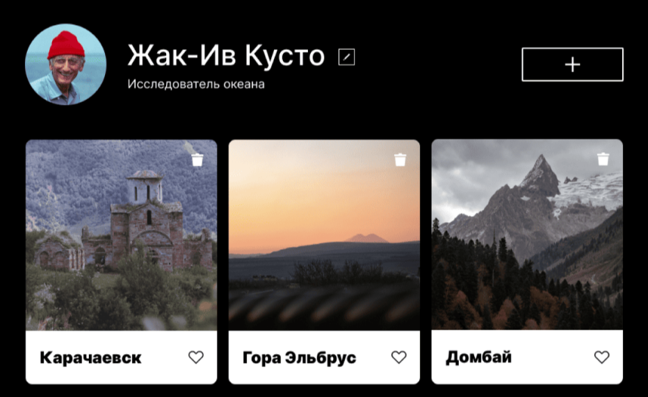
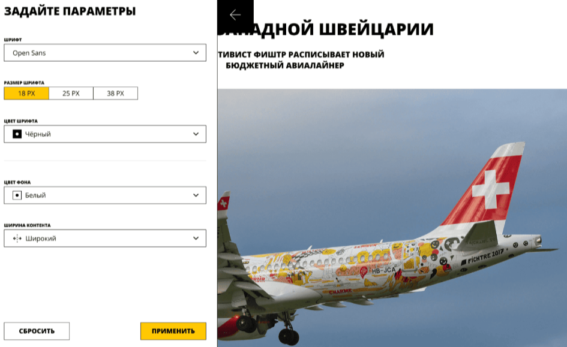

<h1 align="center">
    Всем привет! меня зовут 
    <a href="https://github.com/atvk" target="_blank">Стебловский Антон</a>
    
</h1>

## Обо мне:

Меня зовут Антон и я активно ищу интересную работу в области веб-разработки.

За спиной более 15 лет опыта в клиентском сервисе в компаниях ИКЕА и Купибилет и я считаю, что это очень хороший бэкграунд для фронтенда,
я действительно много знаю об ожиданиях современного клиента и о том как должен вести себя бизнес, чтобы этим ожиданиям соответствовать.

Но время не стоит на месте и мне нужно двигаться вперед!

Сейчас подошло к концу моё обучение в <a href="https://practicum.yandex.ru/frontend-developer/?from=catalog" target="_blank">Яндекс.Практикуме</a> и 
я ищу работу, где смогу применить свои новые навыки и опыт в деле.

Итак что я умею?

Да собственно всё, что есть в программе курса <a href="https://practicum.yandex.ru/frontend-developer/?from=catalog" target="_blank">Фронтенд-разработчик</a>

HTML CSS SCSS Flexbox Git Bash JavaScript TypeScript React Redux Grid Layout DOM Webpack Vite React Router ООП NextJS Tailwind. 

## Мои контакты:

## Мой стек:

  &nbsp
  &nbsp
  &nbsp
  &nbsp
  &nbsp
  &nbsp
  &nbsp
  &nbsp
  &nbsp
  &nbsp
  &nbsp
  &nbsp
  &nbsp
  &nbsp
  &nbsp
  &nbsp

## Портфолио:

  

      &nbsp;
      &nbsp;
    &nbsp;
    &nbsp;
    &nbsp;
    &nbsp;
    &nbsp;
    &nbsp;
    &nbsp;
    &nbsp;
    
  

